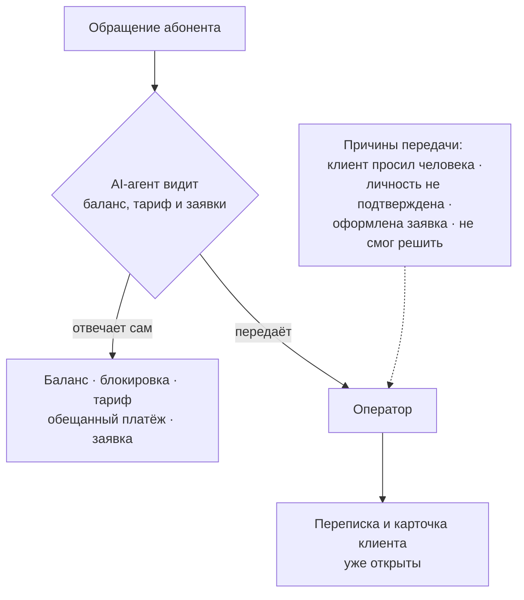

Идея «поставим бота на первую линию» обычно заканчивается одинаково: бот
отвечает общими словами, клиент пишет «оператора», оператор читает переписку
заново. Формально нагрузка снята, фактически добавился лишний шаг.

Разница между таким ботом и рабочим AI-агентом — в двух вещах: **знает ли он
клиента** и **понимает ли, когда замолчать и позвать человека**. Ниже — как эта
граница выглядит на практике.

## Почему «умный бот» без доступа к данным бесполезен

Типичный вопрос абонента звучит так: «почему у меня не работает интернет».
Ответ на него зависит от того, чего бот не знает: какой у человека баланс, есть
ли блокировка, была ли авария на его узле, платил ли он в этом месяце.

Агент, подключённый к биллингу, отвечает конкретно: видит минус на счёте и
блокировку по задолженности, называет сумму, предлагает обещанный платёж и
рассказывает, через сколько минут включится доступ после оплаты. Диалог из
пяти реплик с оператором превращается в одну.

Тот же принцип работает и в обратную сторону: если баланс положительный,
блокировки нет, а сессия не поднимается — это уже не вопрос к поддержке первой
линии, и агент честно переводит обращение дальше.

## Где агент отвечает сам

По статистике рабочей установки за месяц — **76,6 % обращений закрываются без
участия оператора**. Это не «бот что-то ответил», а обращения, где клиент
получил решение и не потребовал человека.

Что попадает в эти три четверти:

- **Баланс, начисления, дата списания.** Самый частый вопрос вообще.
- **Причина блокировки** и как её снять.
- **Обещанный платёж** — агент подключает его сам, если условия позволяют.
- **Тарифы и смена тарифа** — что доступно, сколько стоит, когда вступит в силу.
- **Реквизиты и способы оплаты**, куда идти и что нажимать.
- **Оформление заявки**: заявка на подключение или на ремонт создаётся прямо из
  диалога, с адресом и контактом.

Работает это во всех каналах, где живёт клиент: на сайте, в мессенджерах, по
почте и на телефонной линии — голосом. Для абонента это один и тот же
собеседник, для вас — одна настройка.

## Где он обязан позвать человека

Здесь важнее не «что умеет», а «где останавливается». Агент передаёт диалог
оператору в четырёх случаях:

1. **Клиент попросил человека.** Без споров и попыток «давайте я всё-таки
   помогу» — это самый быстрый способ испортить впечатление.
2. **Не удалось подтвердить личность.** Всё, что касается денег и договора,
   требует уверенности, что говорим с абонентом, а не с соседом.
3. **Оформлена заявка**, по которой дальше работает человек — монтаж, ремонт,
   выезд.
4. **Не смог решить.** Вопрос вне его компетенции или ответ не помог.

Разделять эти причины важно: только четвёртая — показатель качества. Если
считать эскалацией всё подряд, метрика превращается в кашу, и по ней невозможно
понять, стало лучше или хуже.

> Обращение попадает оператору вместе со всей перепиской и карточкой клиента.
> Человек не начинает разговор с нуля и не просит клиента «повторить, что
> случилось».

Развилка, по которой проходит каждое обращение:

## Что это даёт по деньгам и по нервам

- **Ночь и выходные перестают быть провалом.** Обращения, которые раньше ждали
  утра, закрываются сразу.
- **Первая линия занимается сложным.** Оператор не отвечает в сотый раз «у вас
  минус 340 рублей».
- **Ответ мгновенный.** Время первого ответа перестаёт зависеть от того,
  сколько человек сегодня на смене.

При этом агент не заменяет поддержку — он снимает с неё повторяющееся.
Аварии, конфликтные ситуации, нестандартные договорённости остаются людям, и
это правильно.

## С чего начать

Не нужно включать всё сразу. Разумный порядок такой:

1. Подключить агента **на одном канале** — обычно это виджет на сайте.
2. Дать ему доступ к балансу, тарифам и заявкам: без этого он бесполезен.
3. Настроить, при каких словах он сразу зовёт человека.
4. Через две недели посмотреть, что он не смог закрыть, и дописать эти темы в
   базу знаний.
5. Только потом добавлять мессенджеры и телефонную линию.

Модуль «AI-ассистент» и модуль «Поддержка» описаны на
[странице модулей](/#modules), настройка каналов и базы знаний — в
[документации](https://docs.billing.smit34.ru/pages/billing.html#ai-agent).
