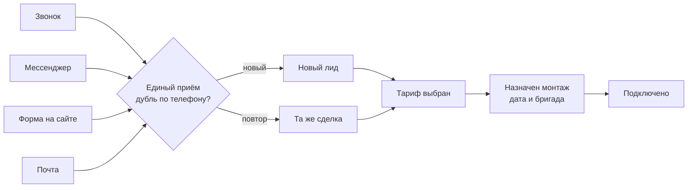

Спросите у любого небольшого оператора, сколько заявок он потерял в прошлом месяце.
Точного ответа не будет. Не потому что учёт плохой, а потому что заявки приходят
в пять разных мест: звонок на мобильный менеджеру, сообщение в мессенджер, форма
на сайте, письмо на общий ящик и «мне сосед сказал, позвоните». Каждый канал живёт
своей жизнью, и «потерялась» обычно значит «никто не помнит, чья она была».

Разберём маршрут, на котором заявка не теряется — по шагам, как он устроен в
СмИТ Биллинге.

## Шаг 1. Один вход вместо пяти

Первое, что нужно сделать, — свести все каналы в один поток. Звонок, сообщение
из мессенджера, письмо, форма на сайте и заявка от AI-виджета попадают в общий
приём. Дальше система решает, что с обращением делать: это новый клиент или уже
существующий, первое обращение или повторное.

Ключевая деталь — **проверка дублей по телефону**. Человек оставил заявку на
сайте, не дождался ответа и позвонил. Без проверки это две сделки, два менеджера
и два звонка клиенту с одинаковым вопросом. С проверкой — одна сделка, в которой
видно оба касания. Окно контроля дублей настраивается на источнике: где-то
разумно считать повтором обращение в течение суток, где-то — в течение недели.

Адрес из заявки сразу разбирается и ставится на карту. Это не украшение: когда
на район приходит пять заявок за неделю, их видно на карте кучкой — и монтажную
бригаду можно отправить одним выездом.

Весь маршрут целиком выглядит так:

## Шаг 2. Воронка вместо памяти менеджера

Заявка становится сделкой и встаёт в воронку. Стадии — это не абстрактные
«в работе» и «думает», а конкретные шаги вашего процесса: новый лид, тариф
выбран, назначен монтаж, подключено.

Что это даёт руководителю:

- видно, **сколько заявок в работе прямо сейчас** и на какую сумму;
- видно, **где они застряли**: если в стадии «тариф выбран» лежит полсотни
  карточек, проблема не в рекламе, а в том, что до монтажа никто не доводит;
- у каждой карточки есть счётчик дней в стадии — он краснеет, и это повод
  позвонить сегодня, а не «когда вспомним».

Правила входа в стадию не пустят сделку дальше, если не заполнено главное.
Нельзя назначить монтаж без монтажника и даты — не потому что система вредная,
а потому что «назначенный» монтаж без даты и есть та самая потерянная заявка.

## Шаг 3. Монтаж — в системе, а не в переписке

Дальше начинается место, где теряется больше всего. Менеджер договорился с
клиентом на четверг, написал бригадиру в личку, бригадир прочитал и забыл.
Клиент ждёт, никто не приехал.

Когда дата и наряд живут в системе, у каждого участника своя картина:

- монтажник открывает на телефоне список нарядов на сегодня — с адресом,
  контактом и тем, что нужно сделать;
- менеджер видит, что наряд назначен и на какое время;
- руководитель видит загрузку бригад в календаре и не ставит четыре монтажа
  на одно утро.

Здесь же — материалы. Кабель, роутер, оптический модуль списываются **из
наряда**, а не «задним числом в конце месяца». Оборудование сразу привязано к
клиенту и адресу: через полгода при аварии видно, что именно у него стоит и с
какого числа.

## Шаг 4. Честная оценка рекламы

Самый неудобный вопрос к маркетингу — «какой канал принёс подключения».
Не заявки, а именно подключения: заявок можно нагнать сколько угодно, если не
считать, сколько из них дошло до денег.

Когда каждая заявка знает свой источник и сделка доходит до стадии «подключено»,
цепочка замыкается сама: видно, сколько лидов дал канал, сколько из них
подключилось и какая выручка за этим стоит. Дальше решение принимается цифрами,
а не ощущением «в этом месяце вроде много звонили».

## Что в итоге меняется

| Было | Стало |
| --- | --- |
| Заявки в пяти местах | Один вход, дубли отсекаются по телефону |
| «Кто-то этим занимался» | У каждой сделки есть стадия и ответственный |
| Договорённости в личке | Дата и наряд видны бригаде и руководителю |
| «Реклама вроде работает» | Видно, какой канал довёл до подключения |

Ни один из шагов не требует героизма — требуется только, чтобы работа велась в
одном месте. Дальше система сама показывает, где именно у вас узкое место: у
кого-то это первый ответ, у кого-то монтаж через две недели, у кого-то —
менеджер, который «забывает» перезвонить дважды в неделю.

Подробнее о разделе продаж — в [документации](https://docs.billing.smit34.ru/pages/crm.html),
там же разобраны источники заявок, правила входа в стадии и автоматизация.
